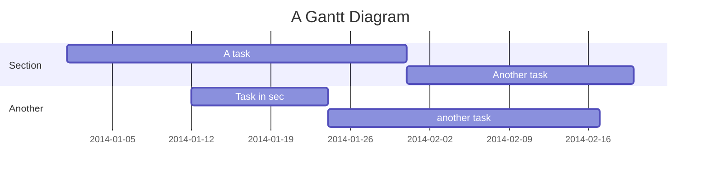

In this article, I will show you how can automate the publishing of your AAB/APK to the `Google Play Console`.
We will be using the [Gradle Play Publisher](https://github.com/Triple-T/gradle-play-publisher) (GPP) plugin to do
automate this process for us. Using this plugin we cannot only automate the publishing and release of our app,
we can also update the release notes, store listing (including photos) all from GitLab CI. 

**Note:** In this article I will assume that you are using Linux and React Native version >= 0.60.

---------------------------------------------------------------------------------------------------