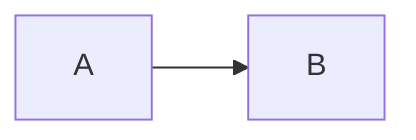
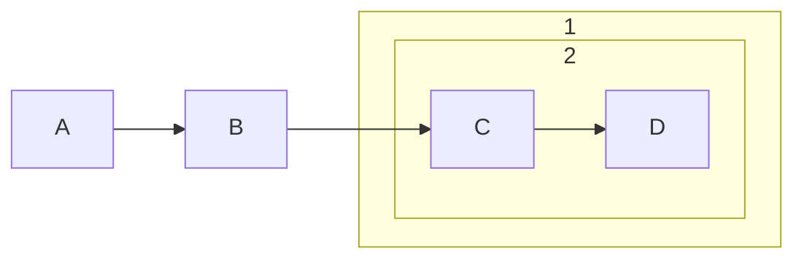
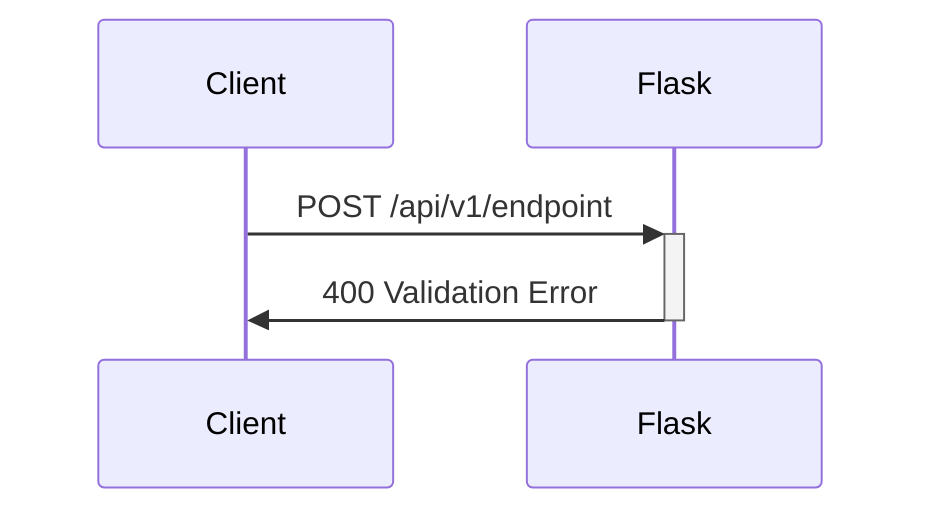

## Introduction

Example Document

## Heading


```mermaid
graph LR;
	A --> B;
```

> INFO: Info



```mermaid
graph LR;
  A --> B
  B --> C
  subgraph 1;
  subgraph 2;
  C --> D;
  end
  end;
```

* List

### Adding a Service


```mermaid
sequenceDiagram
  Client ->>+ Flask: POST /api/v1/endpoint
  Flask ->>- Client: 400 Validation Error
```


### Another Heading


```json
{
  "hello": "bye"
}
```